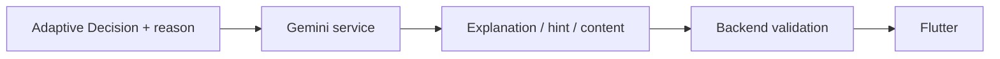
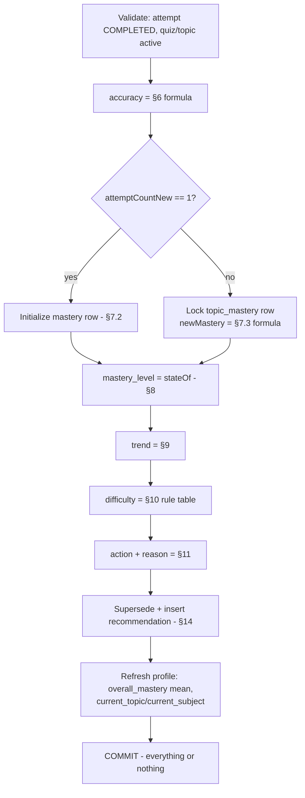

# GameLearn AI — Adaptive Engine Specification

---

## 1. Document Metadata

| Field | Value |
|---|---|
| Document name | GameLearn_AI_Adaptive_Engine_Specification.md |
| Version | 1.0.0 |
| Status | **APPROVED — READY FOR PHASE 5 IMPLEMENTATION** |
| Purpose | Single source of truth for all deterministic adaptive-learning logic (mastery, trend, difficulty, next action, recommendation) to be implemented in Phase 5 |
| Owner | Project Owner (approval), Member 2 (implementation) |
| Dependencies | GameLearn_AI_Database_Specification.md (schema authority), GameLearn_AI_Backend_AI_Specification.md §16–§21 (architecture authority), Phase 4 quiz pipeline (evidence source) |
| Implementation phase | Phase 5 — Adaptive Learning Engine & Mastery System |
| Gemini dependency | **NONE.** This engine is fully deterministic and offline-capable |

This document fills ONLY the decisions explicitly marked `[TBD — ADAPTIVE ENGINE DECISION]` in the Backend + AI Specification (§16, §17, §19, §21) and declared non-goals in the Database Specification (§38). It must not be read as overriding any approved requirement.

---

## 2. Purpose

GameLearn AI's core differentiator is the feedback loop:

```
LEARN → PLAY/PRACTICE → ASSESS → ANALYZE → ESTIMATE MASTERY
      → UNDERSTAND LEARNER STATE → ADAPT → CONTINUE → REASSESS
```

Without an Adaptive Engine the app is a static quiz bank. With one, every verified quiz result changes what the learner sees next: a struggling learner is routed to review and easier content; a strong learner is challenged harder. This specification makes that loop:

- **deterministic** — identical inputs always produce identical outputs;
- **explainable** — every decision carries a stable machine-readable reason;
- **testable** — Section 28 defines the acceptance test matrix before implementation;
- **secure** — only backend-verified evidence feeds the engine;
- **Gemini-independent** — core learning decisions never depend on an external AI service.

---

## 3. Scope

### 3.1 This specification controls

| Area | Status |
|---|---|
| Performance analysis (accuracy semantics) | DEFINED |
| Topic mastery initialization / update / bounds | DEFINED |
| Mastery states and thresholds | DEFINED |
| Trend calculation | DEFINED |
| Difficulty adaptation | DEFINED |
| Next learning action | DEFINED |
| Decision signal priority | DEFINED |
| Recommendation persistence (per quiz event) | DEFINED |
| Idempotency & transaction model | DEFINED |
| Explainability reason codes | DEFINED |
| Configuration constants | DEFINED |
| Learner profile aggregate refresh (`overall_mastery`, `current_topic`) | DEFINED |
| Topic selection (cross-topic) | DEFERRED (§12) |
| Progress `completion_percentage` derivation | DEFERRED (§13) |

### 3.2 This specification does NOT control

- XP, levels, achievements, streaks, badges (Gamification phase)
- AI-generated content, hints, tutoring, question/path generation (AI phases)
- Learning-path generation or prerequisite modeling
- Assessment engine (ASMT-001..003)
- Deployment/infrastructure
- Any change to existing tables or endpoints beyond the additive response field defined in §26

---

## 4. Architecture

```mermaid
flowchart TD
    A[POST /api/v1/quiz/{quizId}/submit] --> B[Phase 4: evaluate answers,\npersist QuizAttempt + QuestionAttempts]
    B --> C[Adaptive Engine - same transaction]
    C --> D[Performance Analysis\naccuracy per attempt]
    D --> E[Mastery Engine\nload-or-init topic_mastery]
    E --> F[Learner State\nmastery_level + trend]
    F --> G[Difficulty Engine\nnext current_difficulty]
    F --> H[Next Action Engine\nactivity type + reason]
    G --> I[Recommendation persist\nsupersede + insert]
    H --> I
    E --> J[Profile refresh\noverall_mastery, current_topic]
    I --> K[COMMIT]
    J --> K
    K --> L[QuizResultResponse + adaptive block\nto Flutter]
```

Future Gemini integration (separate, later phase):



**Rule:** Gemini is NEVER authoritative for mastery, score, learner state, difficulty state, progression, or recommendations. The Adaptive Engine runs with zero network dependencies.

---

## 5. Input Data

Every input is already persisted by Phases 1–4. No new data sources.

| # | Name | Type | Source (table.column) | Required | Valid range | Meaning |
|---|---|---|---|---|---|---|
| I1 | userId | UUID | authenticated principal → users.id | yes | — | Owning learner; NEVER taken from request body |
| I2 | topicId | UUID | quizzes.topic_id → topics.id | yes | — | Subject of the assessment |
| I3 | attemptId | UUID | quiz_attempts.id | yes | — | Evidence event identifier; idempotency key |
| I4 | correctCount | INT | quiz_attempts.correct_count | yes | 0..totalQuestions | Server-evaluated correct answers |
| I5 | totalQuestions | INT | quiz_attempts.total_questions | yes | ≥1 | Questions in the quiz (Phase 4 rejects zero-question quizzes) |
| I6 | accuracy | DECIMAL(5,2) | derived (§6) | yes | 0.00–100.00 | Percentage of correct answers incl. unanswered as incorrect |
| I7 | attemptCountNew | INT | derived: previous topic_mastery.attempt_count + 1 | yes | ≥1 | Topic-level attempt ordinal including this attempt |
| I8 | previousMastery | DECIMAL(5,2) | topic_mastery.mastery_score | init: absent | 0–100 | Prior estimate; absent on first attempt |
| I9 | previousRecentAccuracy | DECIMAL(5,2) | topic_mastery.recent_accuracy | n≥2 | 0–100 | Accuracy of the immediately preceding attempt |
| I10 | currentDifficulty | VARCHAR(20) | topic_mastery.current_difficulty | n≥2 | EASY/MEDIUM/HARD | Difficulty currently assigned to the learner for this topic |
| I11 | quizDifficulty | VARCHAR(20) | quiz_attempts.difficulty_at_attempt | yes | EASY/MEDIUM/HARD | Difficulty of the submitted quiz |

**Explicitly rejected inputs:** any client-supplied mastery, score, correctness flag, difficulty, "state", or priority value. These are ignored even if present in request payloads (Jackson ignores unknown properties; services accept none).

---

## 6. Performance Analysis

### 6.1 Accuracy (REQUIREMENT from schema semantics)

```
accuracy = round_half_up_2( correctCount ÷ totalQuestions × 100 )
```

This matches Phase 4 exactly: `total_questions` counts every question of the quiz and unanswered questions are persisted as `selected_answer = NULL, is_correct = FALSE`. Therefore **unanswered questions count as incorrect** — consistent by construction, not an invention.

Examples: 3/4 → 75.00; 1/3 → 33.33; 2/3 → 66.67; 0/5 → 0.00; 5/5 → 100.00.

### 6.2 Edge semantics

| Case | Behavior |
|---|---|
| Zero-question quiz | Cannot occur — Phase 4 submission rejects it (`MALFORMED_REQUEST`). Defensive rule: abort adaptive processing |
| Unanswered questions | Counted in totalQuestions, treated as incorrect |
| Invalid attempt (not COMPLETED) | Only COMPLETED attempts feed the engine; ABANDONED/IN_PROGRESS are excluded |
| Repeated attempts | Every completed attempt is legitimate evidence (§7.4 governs its weight) |
| Duplicate requests | Each HTTP submission creates its own attempt (Phase 4 behavior); each attempt is processed exactly once (§18) |

---

## 7. Mastery Model

### 7.1 Mastery representation (REQUIREMENT: schema)

- Storage: `topic_mastery.mastery_score DECIMAL(5,2)`
- Interpretation: percentage scale **0.00–100.00**
- All arithmetic in Java `BigDecimal`, scale ≤ 2, rounding HALF_UP (away from zero on negatives)

### 7.2 Initial mastery (D1 — DEFINED)

On the first valid attempt for a topic (`attemptCountNew == 1`):

```
mastery_score = accuracy₁
mastery_level = stateOf(mastery_score)          (§8)
current_difficulty = quizDifficulty             (I11)
recent_accuracy  = accuracy₁
trend            = INSUFFICIENT_DATA
attempt_count    = 1
last_assessed_at = submitted_at
```

Rationale: with no prior evidence the honest estimate IS the observed performance. A neutral 50-start would punish an accurate first attempt and reward a poor one.

### 7.3 Update formula (D2 — DEFINED)

For `attemptCountNew = n ≥ 2`, let `old = previousMastery`, `acc = accuracyₙ`:

```
step        = round_half_up_2( (acc − old) ÷ min(n, 5) )
newMastery  = clamp( old + step , 0 , 100 )
```

Equivalently the evidence weight is `w(n) = 1 / min(n, 5)`:

| n | weight w(n) |
|---|---|
| 2 | 0.50 |
| 3 | ≈ 0.333 |
| 4 | 0.25 |
| ≥ 5 | 0.20 |

Computation order (mandatory for determinism):
1. `delta = acc − old` (exact, scale 2)
2. `step = delta ÷ min(n,5)` computed at scale 2, HALF_UP (away from zero)
3. `candidate = old + step` (exact)
4. clamp candidate into [0.00, 100.00]
5. store (already scale ≤ 2)

**Rejected candidate:** constant `new = 0.7·old + 0.3·acc`. It treats the second attempt and the twentieth identically, allowing steady grinding at a constant inflation rate. The chosen divisor `min(n, 5)` makes early evidence responsive (w₂ = 0.50) while capping late influence at 20% of the remaining gap — repeated perfect scores converge toward 100 but with strictly diminishing steps (see §29 Example 10 chain).

### 7.4 Repeated attempts (REQUIREMENT addressed)

- Every COMPLETED attempt counts exactly once (no skipping, no suppression).
- Diminishing weight `1/min(n,5)` prevents rapid artificial inflation: after five attempts any single result moves the estimate by at most 20% of the gap.
- There is no special retry penalty: a retake is honest evidence of current ability. Deterministic systems cannot distinguish memorization from learning; diminishing weight plus difficulty escalation is the accepted mitigation.
- Immediate retries are NOT filtered (no time window) — no time-dependent behavior (§22).

### 7.5 Bounds (REQUIREMENT)

`clamp(v) = min(100.00, max(0.00, v))`, applied once at step 4. Because `old ∈ [0,100]` and `step` moves toward `acc ∈ [0,100]`, clamping is theoretically unreachable; it exists as a defensive invariant and MUST be implemented.

---

## 8. Mastery States (D3 — DEFINED)

Terminology preserved from the Database Specification (`BEGINNER, DEVELOPING, PROFICIENT, MASTERED`). Ranges are **lower-inclusive, upper-exclusive**, ensuring no gap and no overlap:

| State | Range on mastery_score | Boundary rule |
|---|---|---|
| BEGINNER | 0.00 – 39.99 | m < 40 |
| DEVELOPING | 40.00 – 69.99 | 40 ≤ m < 70 |
| PROFICIENT | 70.00 – 89.99 | 70 ≤ m < 90 |
| MASTERED | 90.00 – 100.00 | m ≥ 90 |

Boundary table:

| mastery_score | State |
|---|---|
| 0.00 | BEGINNER |
| 39.99 | BEGINNER |
| 40.00 | DEVELOPING |
| 69.99 | DEVELOPING |
| 70.00 | PROFICIENT |
| 89.99 | PROFICIENT |
| 90.00 | MASTERED |
| 100.00 | MASTERED |

Threshold rationale (DESIGN DECISION): 40 ≈ "below competence" band end, 70 ≈ conventional proficiency pass line, 90 ≈ mastery demands near-perfect demonstration. Bands are wide enough to avoid oscillation under the ±20%-weight updates.

---

## 9. Trend Engine (D4 — DEFINED)

Approved values (schema): `IMPROVING, STABLE, DECLINING, INSUFFICIENT_DATA`.

```
if attemptCountNew == 1            → INSUFFICIENT_DATA
else:
    delta = accₙ − previousRecentAccuracy          (I9, exact scale-2 subtraction)
    delta > +5.00   → IMPROVING
    delta < −5.00   → DECLINING
    otherwise       → STABLE
after evaluation: recent_accuracy = accₙ   (always updated)
```

| Parameter | Value | Meaning |
|---|---|---|
| Comparison window | last attempt only (`recent_accuracy` vs current accuracy) | Simplest deterministic window; matches stored column |
| Meaningful-change threshold Δ | ±5.00 percentage points | On a 20-question quiz that is exactly one question — the smallest honest "real change" unit; below it, noise dominates |
| One attempt | INSUFFICIENT_DATA | No baseline exists |
| Identical performance | STABLE | delta = 0 |

The threshold 5.00 is a DESIGN DECISION (REQUIREMENT: "avoid arbitrary values unless justified") — justified above and listed as configuration constant `TREND_DELTA = 5.00`.

---

## 10. Difficulty Engine (D5 — DEFINED)

Values fixed by schema: `EASY < MEDIUM < HARD`. Adaptation moves **one step at a time**, capped at both ends.

Inputs used: mastery state (§8), trend (§9), accuracy (§6), current difficulty (I10), attemptCountNew. This satisfies spec §33's requirement that the engine weigh more than raw score.

**State reference:** every condition below evaluates the learner state COMPUTED FROM THE UPDATED mastery of the current attempt (decision-time state), never the pre-update value. The same convention applies in §11.

### Rule table — evaluated strictly top-down; FIRST matching rule wins

| Order | Condition | Difficulty action |
|---|---|---|
| R0 | attemptCountNew == 1 | MAINTAIN (= initialized to quizDifficulty) |
| R1 | state == BEGINNER | DOWN one step (EASY is floor) |
| R2 | trend == DECLINING | DOWN one step (EASY is floor) |
| R3 | accuracy ≥ 85.00 | UP one step (HARD is ceiling) |
| R4 | otherwise | MAINTAIN |

Ladder: `DOWN: HARD→MEDIUM→EASY→(stay EASY)`; `UP: EASY→MEDIUM→HARD→(stay HARD)`.

"Good performance" is thereby **exactly defined**: accuracy ≥ 85.00 on the current attempt, reached only when rules R1/R2 do not fire. "Weak" means BEGINNER state or DECLINING trend — each precisely defined in §8/§9.

Edge behavior: at EASY, weak learners stay at EASY; at HARD, strong learners stay at HARD (reason still recorded — see §21).

---

## 11. Next Action Engine (D6 — DEFINED)

Only enum values already in the database are used: `CONTINUE_LESSON, PRACTICE, REVIEW, QUIZ, REMEDIATION, ADVANCE`.
Same top-down order and winners as §10:

| Order | Winning condition | Action | Reason code |
|---|---|---|---|
| R0 | first attempt | PRACTICE | `FIRST_ATTEMPT_BASELINE_SET` |
| R1 | state == BEGINNER | REVIEW | `BEGINNER_NEEDS_FOUNDATIONS` |
| R2 | trend == DECLINING | REMEDIATION | `RECENT_DECLINE_REMEDIATION` |
| R3 | accuracy ≥ 85.00 | QUIZ — unless state == MASTERED, then ADVANCE | `STRONG_PERFORMANCE_INCREASES_DIFFICULTY` |
| R4a | state == DEVELOPING | PRACTICE | `DEVELOPING_KEEP_PRACTICING` |
| R4b | state == PROFICIENT | QUIZ | `PROFICIENT_CONFIRM_WITH_QUIZ` |
| R4c | state == MASTERED | ADVANCE | `MASTERED_ADVANCE_CHALLENGE` |

`CONTINUE_LESSON` is RESERVED — it becomes meaningful when lesson completion tracking exists (deferred, §13). It is never emitted by Phase 5.

---

## 12. Topic Selection — DEFERRED

**TOPIC SELECTION DEFERRED.**

- Phase 5 adapts WITHIN the assessed topic only.
- Cross-topic selection requires prerequisite/ordering metadata (topic prerequisites, learning-path node sequencing tied to mastery gates) that is not modeled in the approved schema.
- The later Learning-Path / AI-path generation phase owns this decision and may reuse this engine's per-topic outputs (mastery, state, trend) as ranking inputs.
- Consequently `learning_paths` / `learning_path_nodes` are READ-ONLY inputs (not written) in Phase 5, and PATH-001 continues returning caller-owned paths unchanged.

There is no ambiguity: nothing in Phase 5 selects or ranks topics.

---

## 13. Progress Calculation — DEFERRED

**PROGRESS DERIVATION DEFERRED.**

No approved definition exists for what "completion of a topic" means (lesson views? quiz passes? node completion?). Inventing one would violate the no-silent-decisions rule.

Consequences for Phase 5:
- `progress` rows are NOT created, updated, or deleted by the Adaptive Engine.
- `progress.completion_percentage`, `.status`, `.last_activity_at`, `.completed_at` remain untouched (defaults).
- PROG-001/PROG-002 continue to return whatever rows exist (initially empty lists / 404), exactly as delivered in Phase 3.
- When Gamification/Lesson-tracking phases define completion semantics, progress derivation plugs into the same transaction point reserved in §19.

---

## 14. Recommendation Engine (D9 — DEFINED)

Phase 5 persists ONE deterministic recommendation per processed attempt, derived entirely from the decision outcome (spec §21 flow: mastery/rule → recommendation).

### Write policy (per processed attempt)

1. **Supersede:** all existing recommendations with `status = 'ACTIVE' AND user_id = :user AND topic_id = :topic` are updated to `status = 'CONSUMED'`, `consumed_at = now`.
2. **Insert** one new row:

| Column | Value |
|---|---|
| user_id | authenticated learner |
| topic_id | assessed topic (never NULL in Phase 5) |
| activity_type | action from §11 |
| recommended_difficulty | next difficulty from §10 |
| priority | REVIEW/REMEDIATION → 1 · PRACTICE → 2 · QUIZ → 3 · ADVANCE → 4 (lower = more urgent) |
| status | ACTIVE |
| generated_at | submission timestamp |
| reason | `"<REASON_CODE>: " + deterministic sentence` (templates in §21) |
| consumed_at | NULL |

### Properties

- Max ACTIVE recommendations per (user, topic): **1** (policy; superseded otherwise). Active count across topics is naturally bounded by topics touched.
- EXPIRED status reserved for a future TTL policy — never written in Phase 5.
- No randomness, no LLM text: sentences come from fixed templates filled with deterministic values.
- Rationale for supersede-instead-of-append: keeps the Flutter "next step" screen unambiguous without inventing new schema (no unique constraint exists; adding one would require a DB-spec update — see §27).

---

## 15. Adaptive Decision Pipeline

Executed INSIDE the Phase 4 submission transaction (single invocation path):



Step contract: each box consumes only outputs of earlier boxes and §5 inputs. Any exception → full rollback including the Phase 4 attempt rows (client retry then re-executes the whole submission cleanly).

---

## 16. Decision Priority (conflicting signals)

Global precedence hierarchy — every rule table in §10/§11 evaluates in exactly this order:

| Priority | Signal class | Resolves |
|---|---|---|
| P1 | Data validity (attempt/state/topic valid) | Abort on failure |
| P2 | Chronic fundamental weakness — BEGINNER | Easiest support + REVIEW |
| P3 | Recent significant decline — DECLINING | Down-step + REMEDIATION |
| P4 | Recent excellence — accuracy ≥ 85 | Up-step (+QUIZ/ADVANCE) |
| P5 | Aggregate mastery state | Default maintain/action |

Worked conflicts:

- **MASTERED but DECLINING** → P3 beats P5: difficulty DOWN, action REMEDIATION. Recent negative evidence outranks lagging aggregate.
- **BEGINNER but strong single accuracy (≥85)** → P2 beats P4: REVIEW + down/maintain difficulty; the aggregate has not yet earned challenge. (Transient by construction: one more strong result lifts mastery out of BEGINNER via §7.3.)
- **PROFICIENT + IMPROVING + accuracy 88** → P4 fires: up-step, QUIZ.

Rationale: safety-first ordering protects struggling learners from escalations, and recency outranks stale aggregates because mastery itself is a lagging indicator.

---

## 17. Edge Cases (all deterministic)

| # | Case | Behavior |
|---|---|---|
| E1 | First quiz on topic | Initialize per §7.2; trend INSUFFICIENT_DATA; difficulty = quizDifficulty; action PRACTICE |
| E2 | Zero correct answers | accuracy 0.00; update/init normally; BEGINNER likely → REVIEW |
| E3 | All correct | accuracy 100.00; R3 fires (unless P2/P3); ceiling at HARD respected |
| E4 | All incorrect | accuracy 0.00; state pulled down; R1/R2 route to support |
| E5 | Incomplete attempt (ABANDONED) | Never processed (only COMPLETED exists post-Phase-4) |
| E6 | Unanswered questions | Included in totalQuestions, scored incorrect (§6) |
| E7 | Repeated attempts | Weighted 1/min(n,5); all count |
| E8 | Duplicate requests | Distinct attempts, each processed once; no double-update of a SINGLE attempt (§18) |
| E9 | Invalid attempt id | Submission path cannot occur; future reprocessing API → 404 |
| E10 | Missing topic | Impossible (FK); defensive abort |
| E11 | Missing mastery record | n==1 branch creates it |
| E12 | Mastery exactly on threshold | §8 boundary table (40/70/90 lower-inclusive) |
| E13 | Difficulty already EASY, weak learner | Stays EASY; reason still recorded |
| E14 | Difficulty already HARD, strong learner | Stays HARD; reason still recorded |
| E15 | No available next content | Out of scope — content discovery is PATH-001/QUIZ-001's concern; engine returns decision regardless |
| E16 | Learner completed all topics | Topic selection deferred (§12); per-topic adaptation unaffected |
| E17 | Insufficient trend data | INSUFFICIENT_DATA on n==1; never blocks other outputs |
| E18 | Transaction failure mid-pipeline | Full rollback incl. attempt rows; client retry safe (§19) |

---

## 18. Idempotency

**Authoritative identifier: `quiz_attempts.id` (I3).**

Structural guarantee (chosen design): the Adaptive Pipeline executes inside the SAME transaction that inserts the attempt. An attempt therefore exists only if its adaptive processing committed — exactly-once processing by construction. There is no "process later" path in Phase 5, so no replay marker column is needed.

Consequences:

- Network-retried submissions create DISTINCT attempts (Phase 4 behavior) — each is legitimate independent evidence processed once. Mastery reflects the full attempt history via §7.3; nothing is double-counted for a single event.
- If a future async/reprocessing feature is added, it MUST reject attempts already in COMPLETED-with-adaptive-state using `409 ATTEMPT_ALREADY_PROCESSED` (reserved code, unused now).
- Recommendation supersede (§14) is scoped per (user, topic) within the same transaction — a rolled-back transaction leaves the previous ACTIVE recommendation untouched.

Test obligation: rollback test proving a forced failure between attempt-insert and commit leaves ZERO attempt rows, ZERO mastery mutation, ZERO recommendation rows.

---

## 19. Transaction Model (REQUIREMENT from spec §36)

Single `@Transactional` boundary owned by the submission use case:

```
BEGIN
  validate learner/quiz (Phase 4)
  evaluate answers server-side (Phase 4)
  insert quiz_attempt + question_attempts (Phase 4)
  ── Adaptive Engine (this spec) ──
  lock topic_mastery row (PESSIMISTIC_WRITE; create if absent)
  compute accuracy / mastery / level / trend / difficulty / action
  upsert topic_mastery
  supersede ACTIVE recommendations (user, topic) → CONSUMED
  insert recommendation
  lock learner_profiles row (ordered AFTER mastery lock — deadlock-free)
  refresh overall_mastery (mean of learner's topic masteries, 2dp HALF_UP),
          current_topic, current_topic.subject → current_subject
  (XP/level/streak columns untouched — gamification phase)
COMMIT
```

Any failure ⇒ ROLLBACK of everything, including Phase 4 rows. Lock ordering is fixed (mastery → profile) across all code paths to prevent deadlocks. Concurrency: two simultaneous submissions serialize on the row lock; the second reads the first's committed state — no lost updates.

---

## 20. Security

REQUIREMENTS restated as binding rules:

1. Clients can NEVER set mastery, mastery_level, trend, difficulty, recommendation fields, priority, or authoritative progress. No request DTO contains such fields; services ignore unknown properties.
2. Correctness/score originate exclusively from Phase 4 server-side evaluation.
3. Identity comes from Spring Security principal; all engine queries filter by principal.id().
4. Ownership: mastery/recommendation reads/writes always scoped `user_id = principal.id()`; cross-user access impossible by query construction (verified in tests).
5. No SQL string concatenation — Spring Data derived queries / parameterized JDBC only.
6. Reason strings contain no internal identifiers beyond topic/user ids already known to the caller; no stack traces or algorithm internals beyond the documented reason codes.
7. Nothing in the engine performs network calls — no Gemini, no external API (verifiable by grep: no HTTP client imports in adaptive package).

---

## 21. Explainability

Stable machine-readable reason codes (fixed enumeration; never LLM-generated):

| Code | Trigger (rule) | Human template (deterministic fill-in) |
|---|---|---|
| FIRST_ATTEMPT_BASELINE_SET | R0 | Baseline set from your first quiz — keep practicing. |
| BEGINNER_NEEDS_FOUNDATIONS | R1 | Let's revisit the fundamentals of {topic}. |
| RECENT_DECLINE_REMEDIATION | R2 | Recent results dropped — targeted remediation for {topic}. |
| STRONG_PERFORMANCE_INCREASES_DIFFICULTY | R3 | Strong result — difficulty increased to {difficulty}. |
| DEVELOPING_KEEP_PRACTICING | R4a | Keep practicing {topic} to build consistency. |
| PROFICIENT_CONFIRM_WITH_QUIZ | R4b | Solid grasp — confirm it with the next quiz. |
| MASTERED_ADVANCE_CHALLENGE | R4c | Topic mastered — ready for a bigger challenge. |

Reproducibility: given the same input tuple (§5), the same code+template+values are produced byte-for-byte. `{topic}` = topic name; `{difficulty}` = next difficulty.

---

## 22. Determinism

Same inputs (§5) + same stored state + same constants (§23) ⇒ identical outputs:

- mastery_score, mastery_level, trend, next difficulty, activity type, priority, reason string.
- NO random, NO time-of-day logic except recording `submitted_at/generated_at/last_assessed_at` timestamps (stored values, not decision inputs — the ONLY permitted time usage).
- NO LLM/network dependency. Verified by unit tests executing the pure decision functions without Spring context.

---

## 23. Configuration

All constants are **immutable business constants** — compiled into a single final class (e.g. `AdaptiveEngineConstants`), NOT runtime-configurable properties. Changing any value requires a version bump of this specification (business rules must not drift silently via config files).

| Constant | Value | Used by |
|---|---|---|
| MASTERY_MIN / MASTERY_MAX | 0.00 / 100.00 | §7 bounds |
| WEIGHT_DIVISOR_CAP | 5 | §7.3 `min(n,5)` |
| THRESHOLD_BEGINNER_MAX | < 40.00 | §8 |
| THRESHOLD_DEVELOPING_MAX | < 70.00 | §8 |
| THRESHOLD_PROFICIENT_MAX | < 90.00 | §8 |
| TREND_DELTA | 5.00 | §9 |
| STRONG_ACCURACY | ≥ 85.00 | §10/§11 R3 |
| SCALE / ROUNDING | 2 / HALF_UP | everywhere |
| RECOMMENDATION_PRIORITY map | REVIEW=1, REMEDIATION=1, PRACTICE=2, QUIZ=3, ADVANCE=4 | §14 |

---

## 24. Future Gemini Integration

Extension point (later phase): the persisted ACTIVE recommendation (activity_type, recommended_difficulty, reason, topic) is the exact hand-off payload Gemini needs to generate explanations/hints/practice items ("why" + "what next"). Gemini output remains presentation/content only, passes backend validation, and NEVER writes back mastery/difficulty/state. Failure or absence of Gemini degrades gracefully — the deterministic decision stands alone.

---

## 25. Future ML Compatibility

The engine is structured as pure functions over explicit inputs (§5 → §15). A future ML layer could replace ONLY the rule bodies (§7.3, §10, §11) behind the same interfaces, consuming accumulated `topic_mastery` history as training data. Until such time, this deterministic baseline is the system of record and the permanent fallback. No ML framework, model file, or feature store is introduced now.

---

## 26. API Contract

The approved matrix defines NO dedicated adaptive endpoints; per the no-invention rule, Phase 5 adds NO new routes. Instead, the existing QUIZ-002 response gains one ADDITIVE, non-breaking object (additive fields do not break existing consumers):

```
POST /api/v1/quiz/{quizId}/submit     (unchanged path/auth/status 201)
{
  ...existing QuizResultResponse fields...
  "adaptive": {
    "topicId": "<uuid>",
    "masteryScore": 61.11,
    "previousMasteryScore": 75.00,
    "masteryLevel": "DEVELOPING",
    "trend": "DECLINING",
    "nextDifficulty": "MEDIUM",
    "recommendedActivity": "REMEDIATION",
    "reasonCode": "RECENT_DECLINE_REMEDIATION"
  }
}
```

Ownership/authentication inherited from QUIZ-002. Values mirror §15 outputs exactly (they are the same transaction's results). Reads of mastery/history remain available through USER-001 profile (`overallMastery`) — no additional endpoints required.

**RESOLVED BY OWNER APPROVAL (1.0.0)**: the owner's approval of this document constitutes approval of this additive field.

---

## 27. Database Compatibility

Every concept maps to EXISTING columns — no migration needed:

| Concept | Table.Column | Type | Fits? |
|---|---|---|---|
| mastery estimate | topic_mastery.mastery_score | DECIMAL(5,2) | ✔ 0–100, 2dp |
| learner state | topic_mastery.mastery_level | VARCHAR(30) | ✔ enum values exist |
| per-topic difficulty | topic_mastery.current_difficulty | VARCHAR(20) | ✔ EASY/MEDIUM/HARD |
| evidence counter | topic_mastery.attempt_count | INT | ✔ n |
| last-attempt accuracy | topic_mastery.recent_accuracy | DECIMAL(5,2) | ✔ trend baseline |
| trend | topic_mastery.trend | VARCHAR(30) | ✔ enum values exist |
| assessment moment | topic_mastery.last_assessed_at | TIMESTAMP NULL | ✔ set on each event |
| uniqueness | uq_topic_mastery_user_topic | UNIQUE(user_id,topic_id) | ✔ load-or-init key |
| recommendation payload | recommendations.activity_type / recommended_difficulty / reason / priority / status / generated_at / consumed_at | — | ✔ all exist; topic_id nullable but always set |
| profile aggregates | learner_profiles.overall_mastery / current_topic_id / current_subject_id | — | ✔ refreshed by engine |
| evidence source | quiz_attempts.* / question_attempts.* | — | ✔ Phase 4 |

**DATABASE GAP: NONE blocking Phase 5.**

Notes (documented, NOT acted on):
- Recommendations lack UNIQUE(user_id, topic_id, status) — handled by the supersede policy (§14) inside the transaction. If strict DB-level enforcement is ever desired, that is a DATABASE SPECIFICATION UPDATE, out of scope here.
- A future async processing design would need an idempotency marker column on quiz_attempts — explicitly deferred with the async design itself (§18).

---

## 28. Test Specification (acceptance matrix for Phase 5)

Legend: prev = previous mastery/recent_accuracy/difficulty; acc = current attempt accuracy; n = attemptCountNew.

| Test ID | Input (prev → acc, n) | Expected mastery | Expected state | Expected trend | Expected difficulty | Expected action | Priority/Rec | Reason code |
|---|---|---|---|---|---|---|---|---|
| T01 | none → 75.00, n=1 | 75.00 | PROFICIENT | INSUFFICIENT_DATA | =quizDifficulty | PRACTICE | 2 | FIRST_ATTEMPT_BASELINE_SET |
| T02 | 75.00 → 100.00, n=2 | 87.50 | PROFICIENT | IMPROVING (+25.00) | MEDIUM→HARD | QUIZ | 3 | STRONG_PERFORMANCE_INCREASES_DIFFICULTY |
| T03 | 75.00 → 25.00, n=2 | 50.00 | DEVELOPING | DECLINING (−50.00) | MEDIUM→EASY | REMEDIATION | 1 | RECENT_DECLINE_REMEDIATION |
| T04 | 50.00 → 100.00, n=2 | 75.00 | PROFICIENT | IMPROVING | →HARD (if MEDIUM) | QUIZ | 3 | STRONG_PERFORMANCE_INCREASES_DIFFICULTY |
| T05 | 75.00 → 33.33, n=3 | 61.11 | DEVELOPING | DECLINING | HARD→MEDIUM | REMEDIATION | 1 | RECENT_DECLINE_REMEDIATION |
| T06 | 60.00 → 100.00, n=4 | 70.00 | PROFICIENT | IMPROVING | per R-order | QUIZ | 3 | STRONG_PERFORMANCE_INCREASES_DIFFICULTY |
| T07 | 80.00 → 100.00, n=2 | 90.00 | MASTERED | IMPROVING | UP (cap) | ADVANCE | 4 | STRONG_PERFORMANCE_INCREASES_DIFFICULTY |
| T08 | 87.50 → 100.00, n=3 | 91.67 | MASTERED | IMPROVING | stays HARD | ADVANCE | 4 | STRONG_PERFORMANCE_INCREASES_DIFFICULTY |
| T09 | grind: 91.67 → 100.00, n=4 | 93.75 | MASTERED | IMPROVING | stays HARD | ADVANCE | 4 | STRONG_PERFORMANCE_INCREASES_DIFFICULTY |
| T10 | 30.00 → 0.00, n=2 (at EASY) | 15.00 | BEGINNER | DECLINING | stays EASY | REVIEW | 1 | BEGINNER_NEEDS_FOUNDATIONS |
| T11 | 39.99-equivalent state → any, lands 40.00 | 40.00 | DEVELOPING | — | — | — | — | boundary check (pure function) |
| T12 | lands exactly 69.99 / 70.00 | — | DEVELOPING / PROFICIENT | — | — | — | — | boundary check |
| T13 | lands exactly 89.99 / 90.00 | — | PROFICIENT / MASTERED | — | — | — | — | boundary check |
| T14 | 50.00 → 55.00, n=3 (Δ+5.00... compute: 55−50=+5 ≤ +5) | 51.67 | DEVELOPING | STABLE | MAINTAIN | PRACTICE | 2 | DEVELOPING_KEEP_PRACTICING |
| T15 | 50.00 → 44.00, n=3 (Δ−6.00 < −5) | 48.00 | DEVELOPING | DECLINING | DOWN | REMEDIATION | 1 | RECENT_DECLINE_REMEDIATION |
| T16 | 45.00 → 95.00, n=2 (strong but BEGINNER? no—lands 70.00 PROFICIENT) | 70.00 | PROFICIENT | IMPROVING | UP | QUIZ | 3 | STRONG_PERFORMANCE_INCREASES_DIFFICULTY |
| T17 | 20.00 → 100.00, n=5 (lands 36.00: P2 BEGINNER beats P4 strong) | 36.00 | BEGINNER | IMPROVING (+80.00) | DOWN (floor) | REVIEW | 1 | BEGINNER_NEEDS_FOUNDATIONS |
| T18 | duplicate submit (same payload twice) | two attempts, each processed once; mastery equals sequential application, never double-jump | — | — | — | — | — | — |
| T19 | rollback: fail 2nd question-attempt insert | 0 attempts, mastery unchanged, 0 recommendations | — | — | — | — | — | — |
| T20 | unauthenticated / foreign-user access | 401 / invisible (ownership filters) | — | — | — | — | — | — |
| T21 | client injects mastery/score/isCorrect fields | ignored; server values only | — | — | — | — | — | — |
| T22 | determinism: run pipeline twice on cloned state | byte-identical outputs | — | — | — | — | — | — |

\* T15 arithmetic: 50 + (44−50)/3 = 50 + (−6)/3 = 48.00 → corrected expectation **48.00** (verify at implementation: 48.00, DEVELOPING, DECLINING).

T14 arithmetic: 50 + 5/3 = 50 + 1.67 = 51.67 ✓ (STABLE since Δ = +5.00 is not > +5.00).
T15 arithmetic: 50 + (44−50)/3 = 50 − 2.00 = 48.00 ✓.
T17 arithmetic: 20 + (100−20)/5 = 20 + 16.00 = 36.00 ✓ — still BEGINNER despite the perfect score; P2 outranks P4 exactly as §16 specifies.

Implementation MUST satisfy this matrix verbatim; any mismatch is an implementation bug, not a test bug.

---

## 29. Numerical Examples (arithmetic verified programmatically)

All use §7.3 with verified computation (scale-2, HALF_UP):

**Example 1 — First assessment.** Quiz of 4 questions, 3 correct → accuracy 75.00. Init: mastery 75.00, PROFICIENT, INSUFFICIENT_DATA, difficulty = MEDIUM (quiz's), action PRACTICE.

**Example 2 — Strong second assessment.** prev 75.00, n=2, acc 100.00 → step = (100−75)/2 = +12.50 → **87.50**, PROFICIENT, IMPROVING (+25.00), MEDIUM→HARD, QUIZ.

**Example 3 — Weak second assessment.** prev 75.00, n=2, acc 25.00 → step = (25−75)/2 = −25.00 → **50.00**, DEVELOPING, DECLINING, MEDIUM→EASY, REMEDIATION.

**Example 4 — Mixed sequence.** a1: 2/4 → 50.00 DEVELOPING, INSUFFICIENT_DATA, MEDIUM, PRACTICE. a2: 4/4 → 50+(50)/2 = **75.00** PROFICIENT, IMPROVING, →HARD, QUIZ. a3 (quiz of 3, 1 correct): acc 33.33 → 75+(−41.67)/3 = 75−13.89 = **61.11** DEVELOPING, DECLINING (−66.67), HARD→MEDIUM, REMEDIATION.

**Example 5 — Boundary landings.** 60.00, n=4, acc 100 → +40/4 = **70.00** → PROFICIENT (≥70). 80.00, n=2, acc 100 → **90.00** → MASTERED (≥90). Pure mapping: 39.99→B, 40.00→D, 69.99→D, 70.00→P, 89.99→P, 90.00→M.

**Example 6 — Declining trend.** Covered by Examples 3/4b: Δ < −5.00 → DECLINING → REMEDIATION + down-step.

**Example 7 — Increase difficulty.** Example 2: MEDIUM → HARD.

**Example 8 — Already HARD.** prev difficulty HARD, acc 100 → UP attempted, capped → stays HARD. Chain: 87.50, n=3, acc 100 → 87.50+12.50/3 = 87.50+4.17 = **91.67** MASTERED → ADVANCE.

**Example 9 — Already EASY.** BEGINNER at EASY → stays EASY (T10): 30.00, n=2, acc 0 → 30+(−30)/2 = **15.00**, REVIEW.

**Example 10 — Duplicate processing.** Double-tap submits identical payload twice → attempts A1, A2 (each evaluated independently in Phase 4). From baseline 75.00 with acc 100: A1 → 87.50; A2 (n=3) → 91.67. Mastery advanced by the FORMULA twice, never by "adding 100 twice". A single attempt can never be processed more than once (§18 structural guarantee).

Grinding profile (perfect scores from 75): 87.50 → 91.67 → 93.75 → … steps shrink monotonically — diminishing returns demonstrated.

---

## 30. Design Rationale

Each item labeled REQUIREMENT (externally imposed) or DESIGN DECISION (chosen here, owner-approvable):

| Decision | Type | Why |
|---|---|---|
| Accuracy includes unanswered as wrong | REQUIREMENT | Follows Phase 4 persisted semantics; no reinterpretation |
| Init mastery = first accuracy | DESIGN DECISION | Honest estimator; neutral starts distort first impressions; simplest defensible initialization |
| Weighted update 1/min(n,5) instead of constant α=0.3 | DESIGN DECISION | Responsive early (fresh evidence matters), conservative later; directly answers anti-grinding requirement §7.4; single small-integer division keeps BigDecimal math trivial and examples human-checkable |
| Thresholds 40/70/90 | DESIGN DECISION | Conventional pedagogic bands; wide bands resist oscillation; MASTERED kept strict (≥90) so the label stays meaningful |
| Last-attempt-only trend window, Δ=±5 | DESIGN DECISION | Matches stored recent_accuracy column (no new schema); one question on a 20-item quiz = smallest honest change; avoids arbitrary multi-window weighting |
| Single-step difficulty ladder | DESIGN DECISION | Bounded jumps protect learners; trivially testable; honors §19 "weigh context, not naive thresholds" via ordered rules using state+trend+accuracy |
| Unified P2–P5 priority hierarchy | DESIGN DECISION | Conflicts resolved identically in difficulty AND action engines — no contradictory dual hierarchies; safety-first |
| Supersede recommendation policy | DESIGN DECISION | One clear "next step" per topic; works within existing schema (no unique constraint needed); CONSUMED preserves history for analytics |
| Immutable constants, not config | REQUIREMENT-adjacent | Spec §43 forbids magic-number drift; business rules change only with spec versions |
| Deferred: topic selection, progress % | DESIGN DECISION | Dependencies (prerequisites model; completion semantics) don't exist; deferral documented instead of invention |

---

## 31. Versioning

- Current: **1.0.0 — APPROVED — READY FOR PHASE 5 IMPLEMENTATION**
- Any constant/threshold/rule change ⇒ minor bump (1.x.0) with changelog section; additive clarifications ⇒ patch (1.0.x).
- Phase 5 code MUST reference this spec version in the adaptive package README/javadoc.
- Approval transforms status to APPROVED (owner action only); implementation may not proceed before that.

---

## 32. Implementation Rules

1. Phase 5 implementation MUST NOT begin until this document is APPROVED by the owner.
2. After approval, implement ONLY the rules defined here — no invented behavior, no "improvements".
3. Ambiguity discovered during implementation ⇒ STOP and report against this document (do not patch silently).
4. Acceptance = Section 28 matrix passing verbatim + all Phase 1–4 regressions green.
5. The pure decision functions (§7–§11) MUST be unit-testable without Spring/database (isolate from repositories).
6. Any conflict between this document and older specs discovered later ⇒ STOP, report, await owner ruling (priority rules of the project apply).

---

## 33. Open Questions Checklist

| ID | Decision | Status |
|---|---|---|
| D1 | Mastery initialization | **DEFINED** (§7.2) |
| D2 | Mastery update formula | **DEFINED** (§7.3) |
| D3 | Mastery thresholds | **DEFINED** (§8) |
| D4 | Trend algorithm | **DEFINED** (§9) |
| D5 | Difficulty algorithm | **DEFINED** (§10) |
| D6 | Next action algorithm | **DEFINED** (§11) |
| D7 | Topic selection | **DEFERRED** (§12 — learning-path phase) |
| D8 | Progress calculation | **DEFERRED** (§13 — needs completion semantics) |
| D9 | Recommendation persistence | **DEFINED** (§14) |
| D10 | Database compatibility | **PASS — no gaps** (§27) |
| D11 | API compatibility | **PASS — additive QUIZ-002 response field only** (§26; approval of this doc approves it) |

Zero unresolved decisions block implementation once this document is APPROVED. Items D7/D8 are explicit deferrals with owners named — they do NOT gate Phase 5.

---

*End of Specification — Version 1.0.0 — APPROVED — READY FOR PHASE 5 IMPLEMENTATION*
